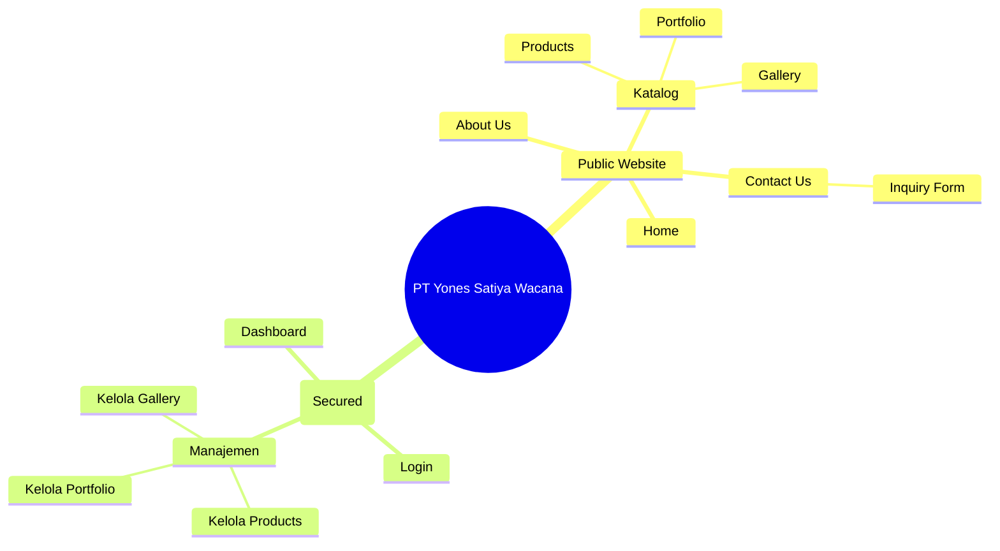

# Information Architecture (IA)
**Project:** PT Yones Satiya Wacana - B2B Company Profile Website

Dokumen ini mendeskripsikan struktur informasi, navigasi, dan tata letak hierarki dari website untuk memastikan *user experience* (UX) yang logis dan efisien.

---

## 1. Sitemap
- **Public Site**
  - Home (Beranda)
  - About Us (Profil Perusahaan)
  - Products (Katalog Minyak Nabati)
  - Gallery (Video Kegiatan)
  - Portfolio (Riwayat Ekspor)
  - Contact Us (Inquiry Form)
- **CMS Admin**
  - Login
  - Dashboard
  - Kelola Produk
  - Kelola Galeri
  - Kelola Portofolio

## 2. Navigation Structure
- **Main Header (Desktop & Mobile)**: Logo (kiri), Link Navigasi Utama (tengah), Toggle Bahasa ID/EN (kanan).
- **Footer**: Informasi Kontak, Alamat Kantor, Link Cepat, dan Copyright.
- **Admin Sidebar**: Menu navigasi vertikal di sisi kiri layar untuk navigasi antar modul CMS.

## 3. Menu Structure
* **Public Menu**: Home | About | Products | Portfolio | Gallery | Contact
* **CMS Menu**: Dashboard | Data Produk | Data Galeri | Data Portofolio | Logout

## 4. Module Structure
* **Marketing Module**: Home, About
* **Catalog Module**: Products, Gallery, Portfolio
* **Communication Module**: Contact Us, WhatsApp Redirect
* **Management Module (CMS)**: Authentication, Dashboard Analytics, CRUD Data

## 5. Screen Inventory
1. `SCR-PUB-01`: Halaman Utama (Hero Section, Value Proposition, Featured Products)
2. `SCR-PUB-02`: Halaman Tentang Kami (Sejarah, Visi Misi)
3. `SCR-PUB-03`: Halaman Produk (Daftar produk turunan kelapa sawit)
4. `SCR-PUB-04`: Halaman Galeri (Grid Embed Video YouTube)
5. `SCR-PUB-05`: Halaman Portofolio (Peta/Daftar riwayat ekspor)
6. `SCR-PUB-06`: Halaman Hubungi Kami (Form CAPTCHA)
7. `SCR-ADM-01`: Halaman Login Admin
8. `SCR-ADM-02`: Dashboard CMS
9. `SCR-ADM-03`: Tabel Produk & Form Tambah/Edit Produk
10. `SCR-ADM-04`: Tabel Galeri & Form Tambah/Edit Video
11. `SCR-ADM-05`: Tabel Portofolio & Form Tambah/Edit Portofolio

## 6. Page Inventory & URL Mapping
| Page Name | URL Path | Type |
| :--- | :--- | :--- |
| Home | `/` | Static/SSG |
| About | `/about` | Static/SSG |
| Products | `/products` | Dynamic/SSG |
| Gallery | `/gallery` | Dynamic/SSG |
| Portfolio | `/portfolio` | Dynamic/SSG |
| Contact | `/contact` | Static/Client |
| Admin Login | `/admin/login` | Client |
| Admin Dashboard | `/admin/dashboard` | Client (Protected) |
| Admin Products | `/admin/products` | Client (Protected) |

## 7. Permission Matrix
| URL Path | Visitor | Superadmin |
| :--- | :--- | :--- |
| `/` hingga `/contact` | **YES** | YES |
| `/admin/login` | NO (Kecuali Punya Akun) | **YES** |
| `/admin/*` (Dashboard, dll) | NO (Redirect ke Login) | **YES** |

## 8. Taxonomy
- **Language**: `id` (Bahasa Indonesia), `en` (English).
- **Portfolio Region**: Pengelompokan tujuan ekspor berdasarkan Benua/Negara (Asia, Eropa, dsb).

## 9. Content Hierarchy (SEO Structure)
- `H1`: Nama Halaman / Judul Utama (Satu per halaman).
- `H2`: Sub-bagian / Nama Produk / Seksi (misal: "Keunggulan Kami").
- `H3`: Detail tambahan / Spesifikasi produk.
- **P / Body**: Deskripsi detail.

## 10. Mobile Navigation
- Menggunakan pola **Hamburger Menu** di sudut kanan atas layar (Mobile Header).
- Saat di-klik, menu akan meluncur (slide/drawer) dari samping atau atas yang memuat link halaman.
- Tombol *WhatsApp mengambang* (Floating Action Button/FAB) di pojok kanan bawah agar mudah dijangkau jempol (Thumb Zone).

## 11. Desktop Navigation
- Menggunakan pola **Top Horizontal Bar** (Header diam/Sticky saat di-scroll).
- Seluruh menu terlihat (*visible*) tanpa perlu klik, untuk mempercepat navigasi B2B klien.

## 12. URL Structure
Untuk mendukung fitur dua bahasa dan SEO terbaik, struktur URL dapat menggunakan *sub-path*:
- ID: `yones-satiya.com/id/products`
- EN: `yones-satiya.com/en/products` (Atau default tanpa `/en`).

## 13. Breadcrumb Strategy
*Breadcrumb* digunakan pada halaman yang lebih dalam untuk navigasi mundur.
* Contoh di Desktop: `Home > Products > Minyak Goreng Sawit`
* Contoh di Mobile: Cukup tombol "← Back" atau *breadcrumb* horizontal yang bisa di-scroll.

## 14. Tree Diagram

