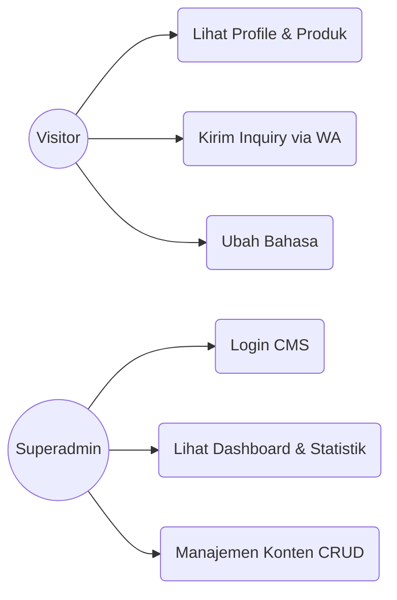
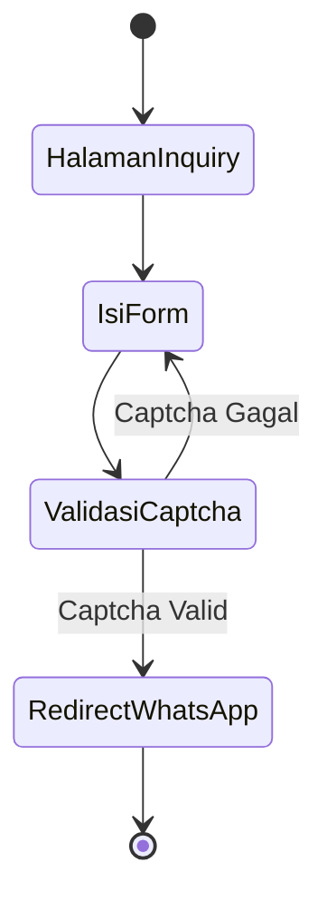
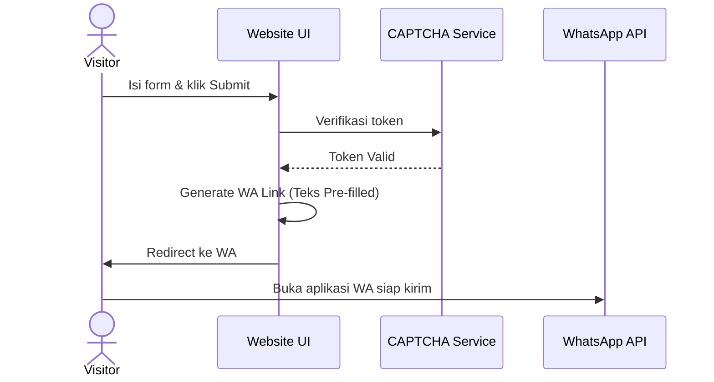
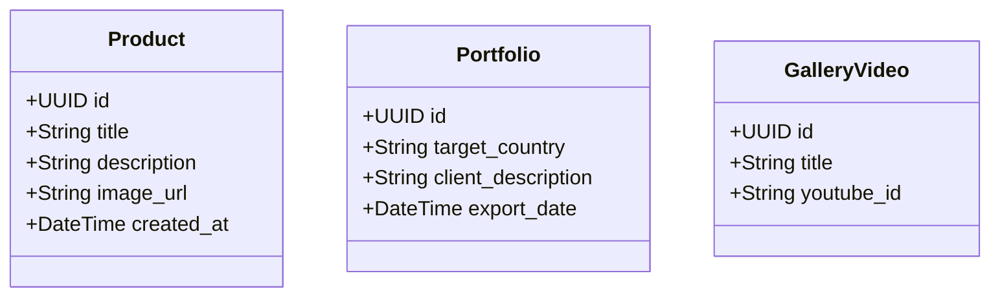
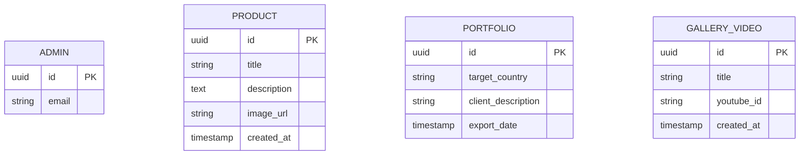
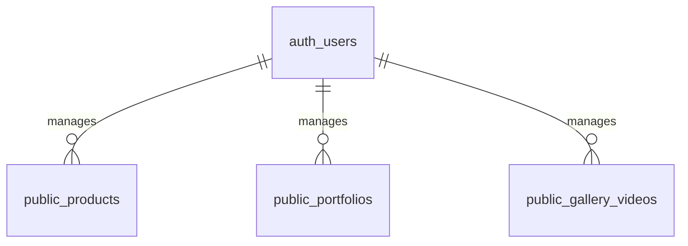

# Software Requirement Specification (SRS)
**Project:** PT Yones Satiya Wacana - B2B Company Profile Website
**Version:** 1.0

## 1. Introduction
Dokumen ini menspesifikasikan kebutuhan perangkat lunak (Software Requirement Specification) untuk pengembangan Website Company Profile B2B PT Yones Satiya Wacana, mengacu pada standar IEEE 29148. Dokumen ini menjadi rujukan (*source of truth*) bagi pengembangan arsitektur dan fungsionalitas sistem.

## 2. System Objectives
Menghadirkan platform *online* yang profesional, SEO-optimized, dan responsif guna menjaring prospek *business-to-business* (B2B) dari pasar domestik maupun internasional, serta menjadi media komunikasi awal yang efektif.

## 3. Scope
Website terdiri dari halaman pengunjung publik (Home, About, Produk, Galeri Video, Portofolio, Inquiry) dan CMS backend (Dashboard, CRUD Konten) dengan memanfaatkan *stack* modern Next.js dan Supabase.

## 4. Stakeholder Analysis
- **Klien B2B/Pengunjung**: Mencari informasi profil, produk turunan kelapa sawit, serta melakukan inquiry bisnis.
- **Superadmin (PT Yones Satiya Wacana)**: Pengelola sistem dan konten website.

## 5. As-Is Process
Saat ini, perusahaan belum memiliki website portofolio resmi, sehingga menyulitkan calon mitra atau *buyer* untuk menemukan profil, rekam jejak, dan produk perusahaan secara online, yang dapat menghambat tingkat konversi *leads*.

## 6. To-Be Process
Calon klien dapat menemukan perusahaan melalui mesin pencari (SEO), melihat katalog produk & portofolio ekspor melalui antarmuka web *multi-bahasa*, lalu mengirimkan inquiry yang akan terhubung langsung ke WhatsApp tim *sales/admin*. Admin dapat mengelola informasi tersebut dengan mudah melalui CMS.

## 7. Functional Requirements
- **FR-01**: Sistem menampilkan halaman profil publik (Home, About, Produk, Galeri, Portofolio).
- **FR-02**: Sistem menyediakan form Inquiry dengan proteksi *anti-spam* (CAPTCHA/Turnstile) yang me-*redirect* pengunjung ke WhatsApp dengan pesan pre-filled.
- **FR-03**: Sistem mendukung pergantian multi-bahasa (Indonesia & Inggris) secara otomatis (*auto-set*).
- **FR-04**: Sistem memiliki halaman CMS bagi Superadmin untuk melakukan manajemen (CRUD) entitas Produk, Portofolio, dan Video Galeri.
- **FR-05**: Sistem menampilkan Dashboard yang memuat agregasi data (jumlah produk, video, portofolio) serta statistik analitik pengunjung.

## 8. Non Functional Requirements
- **NFR-01 (Performance)**: Waktu muat (*load time*) kurang dari 3 detik.
- **NFR-02 (Availability)**: Uptime target minimal 99.9% menggunakan Vercel.
- **NFR-03 (Usability)**: Antarmuka harus sepenuhnya responsif (Desktop, Mobile, Tablet).
- **NFR-04 (Security)**: Routing admin terpisah (hidden route) dan diamankan dengan otentikasi.

## 9. Business Rules
- **BR-01**: Form inquiry tidak akan terkirim (tidak *redirect* ke WhatsApp) jika validasi CAPTCHA gagal.
- **BR-02**: Video dilarang disimpan ke dalam *storage* server. Admin hanya memasukkan *ID/URL YouTube* untuk memunculkan (embed) video.

## 10. User Roles Matrix
| Role | Public Pages | CMS Login | Dashboard CMS | CRUD Konten |
| --- | --- | --- | --- | --- |
| Visitor | Yes | No | No | No |
| Superadmin | Yes | Yes | Yes | Yes |

## 11. Use Case Specification
1. **Visitor mengeksplorasi web**: Visitor membuka web, mengubah bahasa, melihat daftar produk dan video.
2. **Visitor menghubungi perusahaan**: Visitor mengisi form inquiry, sistem memvalidasi CAPTCHA, visitor menekan tombol *submit* dan diarahkan ke aplikasi WhatsApp.
3. **Superadmin mengelola web**: Admin login, memantau grafik dashboard, masuk ke menu manajemen, dan melakukan *Create/Update/Delete* data.

## 12. UML Documentation

### 12.1 Use Case Diagram


### 12.2 Activity Diagram (Proses Inquiry)


### 12.3 Sequence Diagram (Pengiriman Inquiry)


### 12.4 Class Diagram


## 13. Data Model
Sistem memiliki tiga model data utama (konten dinamis) yang dikelola: **Product**, **Portfolio**, dan **GalleryVideo**.

## 14. ERD


## 15. Transformation ERD to LRS
```mermaid
flowchart TD
    E[Conceptual ERD] --> L[Logical Tables in Supabase Postgres]
    E --> |Map to| T1[auth.users (Admin)]
    E --> |Map to| T2[public.products]
    E --> |Map to| T3[public.portfolios]
    E --> |Map to| T4[public.gallery_videos]
```

## 16. LRS (Logical Record Structure)


## 17. Database Schema
Berbasis **PostgreSQL (Supabase)**:
- `products`: id (uuid), title (text), description (text), image_url (text), created_at (timestamptz).
- `portfolios`: id (uuid), target_country (text), client_description (text), export_date (date), created_at (timestamptz).
- `gallery_videos`: id (uuid), title (text), youtube_id (text), created_at (timestamptz).

## 18. Data Dictionary
- `youtube_id`: ID unik 11 karakter dari tautan video YouTube.
- `image_url`: URL gambar yang disimpan di Supabase Storage.

## 19. Notification Matrix
- **Inquiry Notification**: Menggunakan mekanisme *Click-to-chat* WhatsApp. Tidak ada notifikasi email otomatis dari server.

## 20. Security Requirements
- Halaman CMS dilindungi dengan otentikasi *session/JWT*.
- Diaktifkannya kebijakan RLS (Row Level Security) pada Supabase untuk mencegah penambahan, perubahan, dan penghapusan data dari API tanpa token akses otentikasi Superadmin.

## 21. Audit Log Requirements
- Semua baris data menyimpan field `created_at` untuk pelacakan tanggal pembuatan.
- Log analitik akses disimpan otomatis melalui Vercel Web Analytics.

## 22. Reporting Requirements
- **Dashboard**: Menghitung jumlah record agregasi menggunakan fungsi `COUNT()` pada database. Menampilkan data statistik dari *Web Analytics tool*.

## 23. Acceptance Criteria
- Pengunjung dapat melihat website dalam bahasa ID dan EN tanpa masalah.
- Form Inquiry tidak bisa dikirim jika *bot/spam*.
- Admin dapat login ke dalam CMS, menambah data produk, dan secara langsung melihat perubahannya di website publik.
- Video dapat diputar di dalam *website* tanpa meninggalkan halaman.

## 24. Risk Analysis
- **Risiko**: Eksploitasi form inquiry (*Spamming*).
- **Mitigasi**: Menerapkan Turnstile / reCAPTCHA sebelum membuka tautan WA.

## 25. Future Enhancements
- Modul Artikel/Blog untuk *Content Marketing*.
- Integrasi WhatsApp Business API secara utuh (*Auto-reply Bot*).
