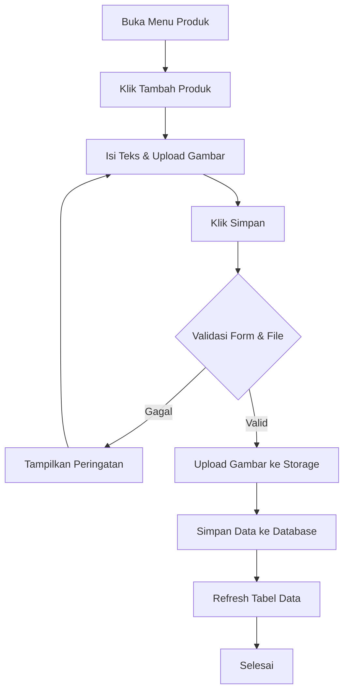

# User Flow (UF)
**Project:** PT Yones Satiya Wacana - B2B Company Profile Website

Dokumen ini mendeskripsikan alur langkah demi langkah (User Flow) untuk fungsi-fungsi utama di dalam sistem.

---

## Flow 1: Pengiriman Inquiry Bisnis

* **Flow Name**: Pengiriman Inquiry Bisnis
* **Actor**: Visitor (B2B Client)
* **Trigger**: Pengunjung menekan tombol "Kirim Pesan" pada form Inquiry.
* **Preconditions**: Pengunjung berada di halaman Contact/Inquiry.
* **Main Flow**:
  1. Pengunjung mengisi data pada form (Nama, Email, Perusahaan, Isi Pesan).
  2. Pengunjung menyelesaikan verifikasi *anti-spam* (CAPTCHA / Cloudflare Turnstile).
  3. Pengunjung menekan tombol "Kirim Pesan".
  4. Sistem memvalidasi isian dan token CAPTCHA.
  5. Sistem me-render tautan WhatsApp API (Click-to-chat) dengan format teks yang membawa data isian pengunjung.
  6. Sistem mengarahkan (redirect) pengunjung ke aplikasi WhatsApp.
* **Alternative Flow**: Jika pengunjung salah memasukkan format email, sistem akan menyorot input email dan meminta perbaikan.
* **Exception Flow**: Jika API *redirect* diblokir oleh *browser* (karena *pop-up blocker*), sistem akan menampilkan tombol sekunder bertuliskan "Klik di sini jika tidak diarahkan otomatis".
* **Validation Rules**: Field Nama, Email, dan Pesan wajib diisi (*required*). Format Email wajib valid (`@` dan `.com`).
* **Error Scenario**: Layanan CAPTCHA gagal dimuat (gangguan koneksi), sistem akan memberitahu pengunjung untuk memuat ulang halaman.
* **Post Conditions**: Pengunjung berada di layar percakapan aplikasi WhatsApp yang sudah tertulis draf pesan untuk dikirim ke tim Sales PT Yones Satiya Wacana.

```mermaid
flowchart TD
    A[Mulai di Halaman Inquiry] --> B[Isi Form Inquiry]
    B --> C[Verifikasi CAPTCHA]
    C --> D{Tekan Submit}
    D --> E{Validasi Sistem}
    E -->|Tidak Valid| B
    E -->|Valid| F[Generate WA Link]
    F --> G[Redirect ke WhatsApp]
    G --> H[Selesai (Di Aplikasi WA)]
```

---

## Flow 2: Autentikasi Admin (Login CMS)

* **Flow Name**: Autentikasi Admin
* **Actor**: Superadmin
* **Trigger**: Mengakses URL `/admin` dan menekan tombol "Login".
* **Preconditions**: Admin memiliki *Email* dan *Password* yang sah terdaftar di Supabase Auth.
* **Main Flow**:
  1. Admin membuka *routing* rahasia CMS.
  2. Admin memasukkan Email dan Password.
  3. Admin menekan tombol "Login".
  4. Sistem melakukan autentikasi ke *backend* Supabase.
  5. Supabase mengembalikan *session token*.
  6. Sistem menyimpan *session* dan mengarahkan Admin ke `/admin/dashboard`.
* **Alternative Flow**: Admin salah memasukkan *password*, sistem memunculkan *toast notification* "Email atau Password salah".
* **Exception Flow**: Terjadi *timeout* pada jaringan, sistem memunculkan notifikasi "Gangguan jaringan, coba lagi".
* **Validation Rules**: Email berformat valid, Password minimal 6 karakter.
* **Error Scenario**: Akun dihapus dari sistem, sehingga *login* ditolak permanen.
* **Post Conditions**: Admin masuk ke Dashboard CMS dengan status terotentikasi penuh.

```mermaid
flowchart TD
    A[Buka Halaman Login CMS] --> B[Input Email & Password]
    B --> C[Klik Login]
    C --> D{Cek Kredensial (Supabase)}
    D -->|Gagal| E[Tampilkan Pesan Error]
    E --> B
    D -->|Berhasil| F[Simpan Sesi Akses]
    F --> G[Arahkan ke Dashboard]
    G --> H[Selesai]
```

---

## Flow 3: Manajemen Konten (Tambah Produk)

* **Flow Name**: Manajemen Konten (Tambah Produk)
* **Actor**: Superadmin
* **Trigger**: Menekan tombol "Simpan Produk" pada halaman form tambah produk.
* **Preconditions**: Admin sudah login dan berada di menu *Manajemen Produk*.
* **Main Flow**:
  1. Admin menekan tombol "+ Tambah Produk Baru".
  2. Sistem menampilkan *modal/form* input.
  3. Admin mengunggah gambar, mengisi Judul, dan Deskripsi (untuk ID & EN).
  4. Admin menekan "Simpan Produk".
  5. Sistem mengunggah (upload) gambar ke Supabase Storage dan mengambil URL-nya.
  6. Sistem menyimpan data *record* teks dan URL gambar ke tabel `products`.
  7. Sistem menutup form dan memperbarui daftar tabel di CMS.
* **Alternative Flow**: Admin tidak mengunggah gambar, sistem menggunakan gambar *placeholder* (default).
* **Exception Flow**: Ukuran gambar melebihi batas maksimal (misal >2MB), sistem menolak dan menampilkan peringatan batas ukuran.
* **Validation Rules**: Judul tidak boleh kosong. File gambar wajib berformat JPG/PNG/WEBP.
* **Error Scenario**: Gagal koneksi saat *upload* ke *Storage*, proses dibatalkan dan memunculkan *toast error*.
* **Post Conditions**: Produk baru langsung tampil di halaman depan website.



---

## Flow 4: Fitur Multi-bahasa

* **Flow Name**: Pergantian Bahasa
* **Actor**: Visitor
* **Trigger**: Menekan *toggle switch* / *dropdown* bahasa (ID ⇄ EN) pada Navbar.
* **Preconditions**: -
* **Main Flow**:
  1. Pengunjung melihat menu navbar dengan bahasa saat ini (misal: ID).
  2. Pengunjung menekan *toggle* ID -> EN.
  3. Sistem menangkap *event* perubahan.
  4. Sistem menyimpan preferensi bahasa di *Local Storage* atau *Cookies*.
  5. Sistem mengganti seluruh komponen teks (*dictionary*) pada layar aktif.
* **Alternative Flow**: -
* **Exception Flow**: -
* **Validation Rules**: -
* **Error Scenario**: -
* **Post Conditions**: Website berubah bahasa secara instan (tanpa *reload* penuh berkat *state management* Next.js).

```mermaid
flowchart TD
    A[Lihat Tampilan ID] --> B[Klik Toggle Bahasa EN]
    B --> C[Set State/Cookies = EN]
    C --> D[Render Ulang Komponen Teks]
    D --> E[Selesai (Tampilan EN)]
```
